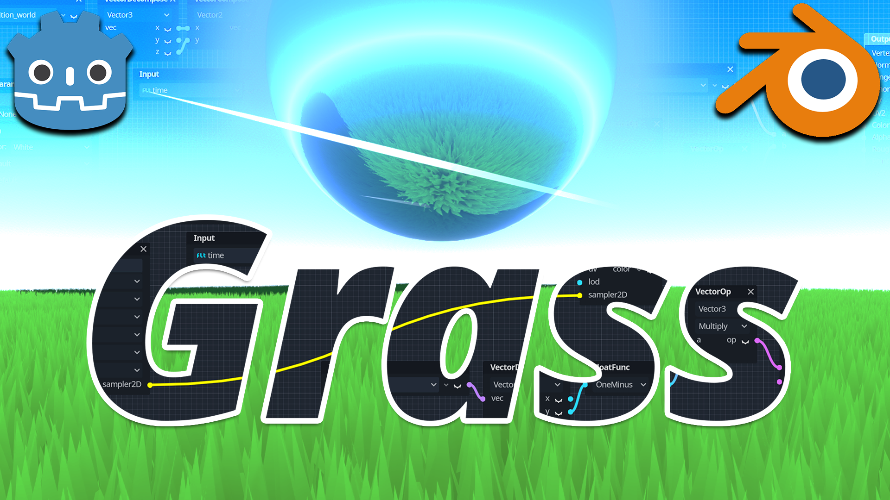
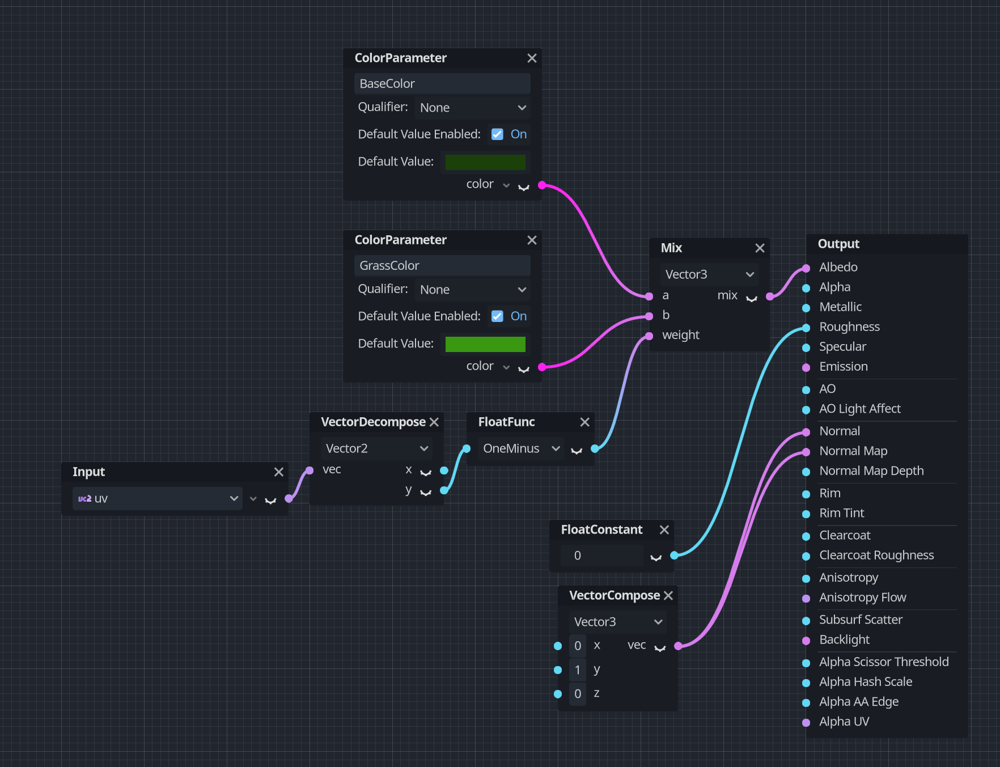
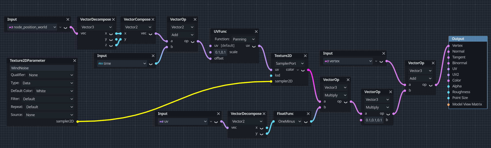

# Godot 4 3D Stylized Grass

This project is a party of a tutorial on Youtube explaining how to make stylized 3D Grass in Godot 4 and Blender from the ground up!

If you just wanted to download the source files rather than following the tutorials step by step, then this is your place!

🔗 [Tutorial: Stylized 3D Grass in Godot 4](https://www.youtube.com/@BramwellWilliams )

## Fragment shader

## Vertex shader

If you're interested in more material or just want to support me, check out my course [Godot 4 Beginners on itch.io](https://bramwell.itch.io/godot-4-beginners) or my [Patreon](https://www.patreon.com/bramwell)! ✨
